# DoveVannoINostriSoldi

Progetto civico open source per capire, con dati ufficiali, come vengono usati i soldi pubblici italiani.

Riunisce fonti pubbliche sparse su portali diversi e le rende leggibili in un unico posto. Ogni numero mostra **fonte**, **periodo** e **limiti**. Un valore insolito indica dove controllare meglio: non dimostra da solo uno spreco o un illecito.

**Sito:** [dovevannoinostrisoldi.com](https://www.dovevannoinostrisoldi.com)

<a href="https://www.buymeacoffee.com/dovevannoinostrisoldi"></a>

Il progetto resta indipendente. Un contributo su Buy Me a Coffee aiuta a pagare compute e hosting; non influenza i dati pubblicati.

## Perché esiste

Bilanci, pagamenti, appalti, debito, partecipazioni e fonti istituzionali esistono già, ma spesso sono dispersi, difficili da confrontare o poco leggibili per chi non lavora tutti i giorni con dati pubblici. DoveVannoINostriSoldi prova a ridurre questa distanza: meno opacità, più contesto, più verificabilità.

## Cosa puoi fare in 2 minuti

- Vedere come spendono Comuni, Stato, sanità ed enti pubblici.
- Confrontare territori, amministrazioni e serie storiche.
- Aprire la fonte ufficiale dietro ogni numero.
- Capire rapidamente che cosa il dato misura, e che cosa non misura.
- Fare domande al catalogo dati e al server MCP in sola lettura.

Oggi il portale copre pagamenti comunali, imprese, istruzione, sanità, pensioni, debito, fondi e progetti, enti, segnali da fonti ufficiali e una pagella economica dei governi. Il [registro fonti](https://www.dovevannoinostrisoldi.com/fonti) elenca 24 collegamenti. Il [catalogo MCP](https://www.dovevannoinostrisoldi.com/mcp) espone 32 dataset interrogabili in sola lettura. L’[assistente](https://www.dovevannoinostrisoldi.com/assistente) risponde su snapshot verificati, senza modello generativo.

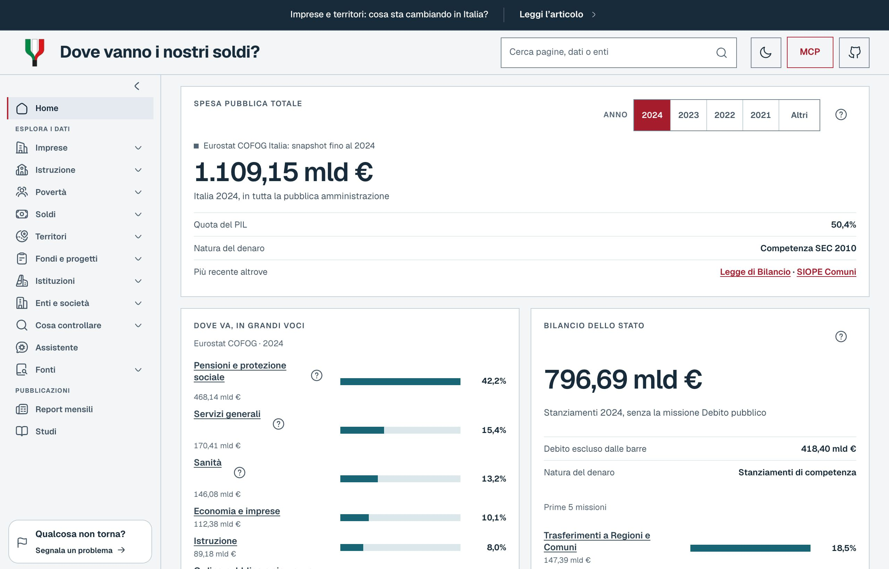

| Territori | Pagella dei governi |
| --- | --- |
| 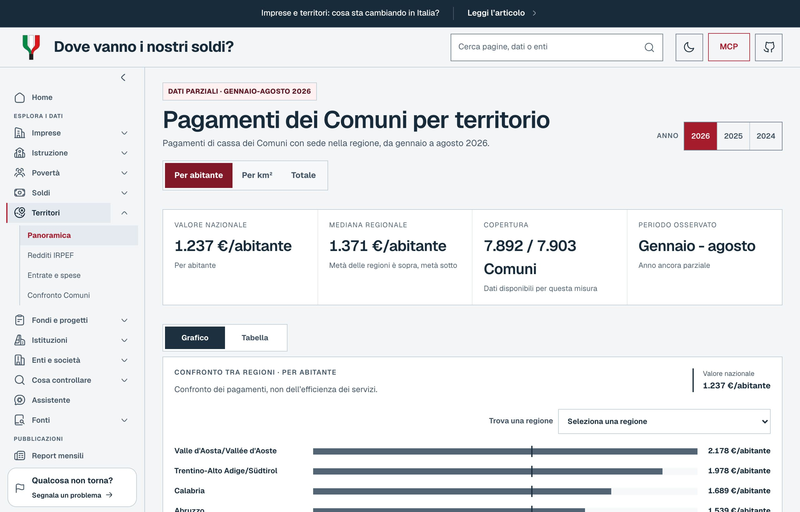 | 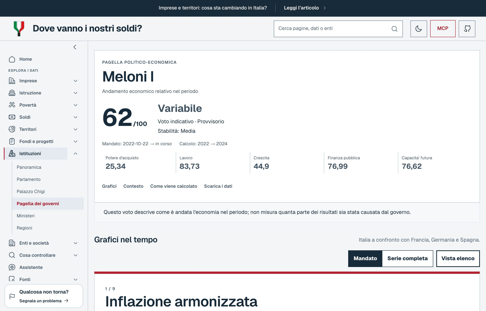 |

| Atlante Istruzione | Atlante Imprese |
| --- | --- |
| 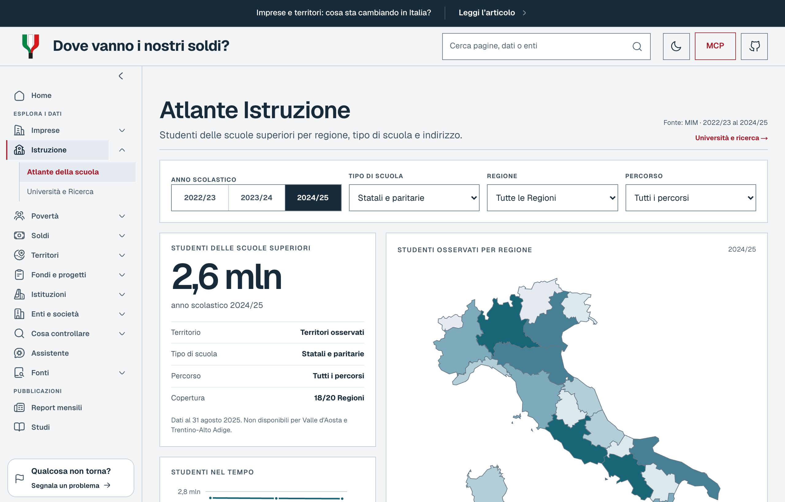 | 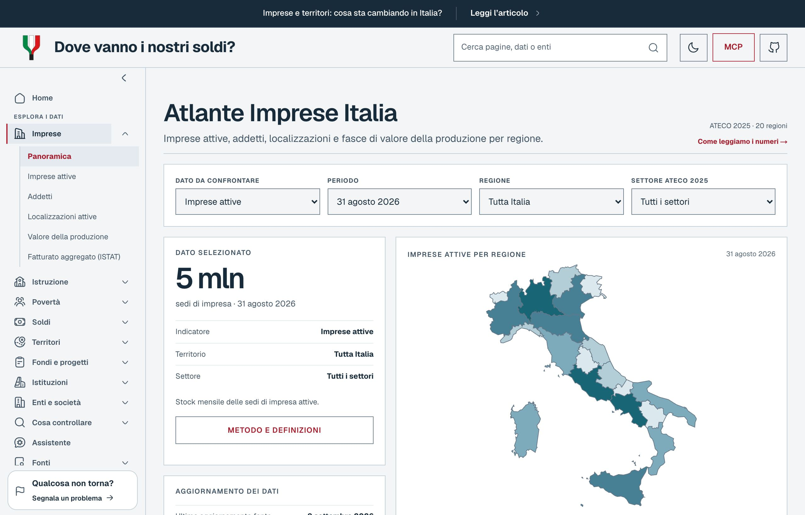 |

| Cosa controllare | Catalogo dati |
| --- | --- |
| 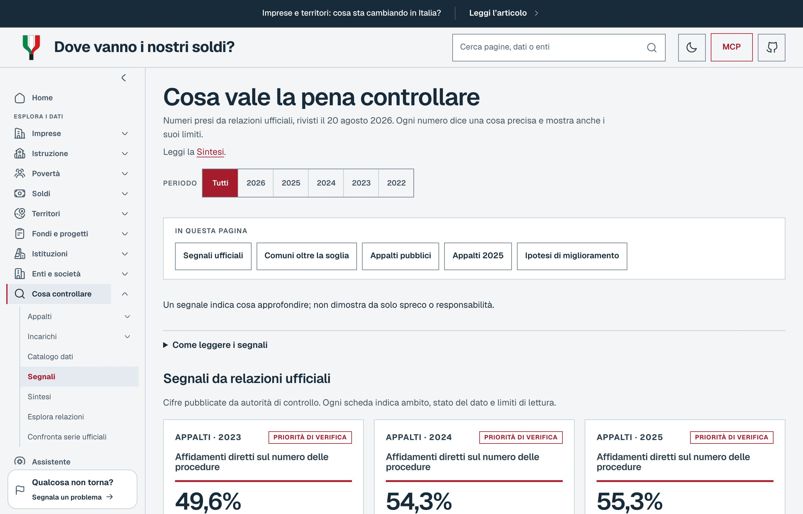 | 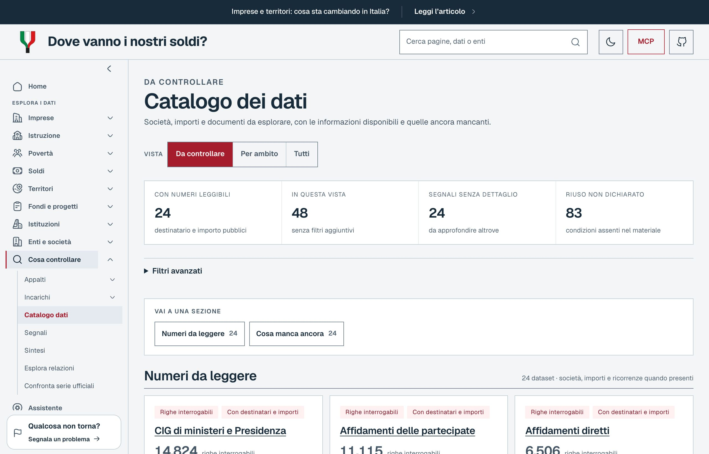 |

| Confronto Comuni | Debito pubblico |
| --- | --- |
| 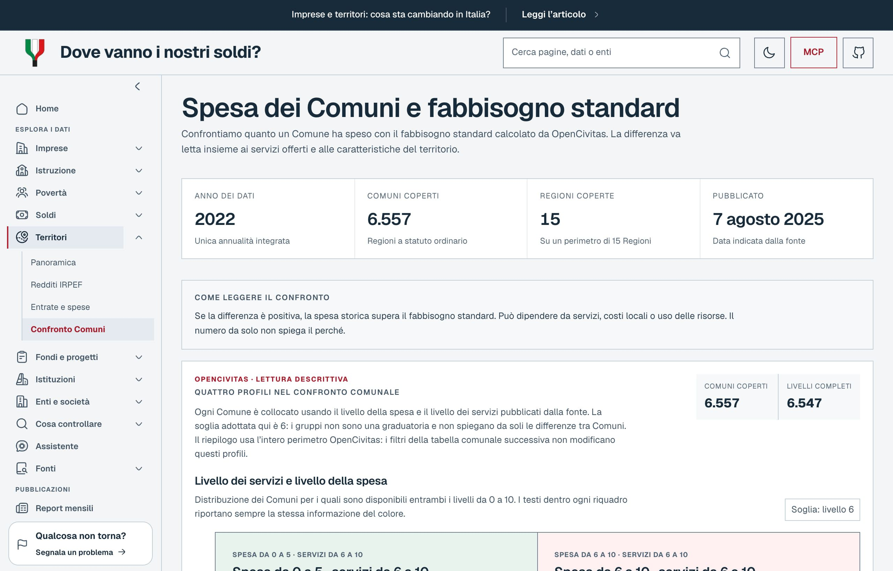 | 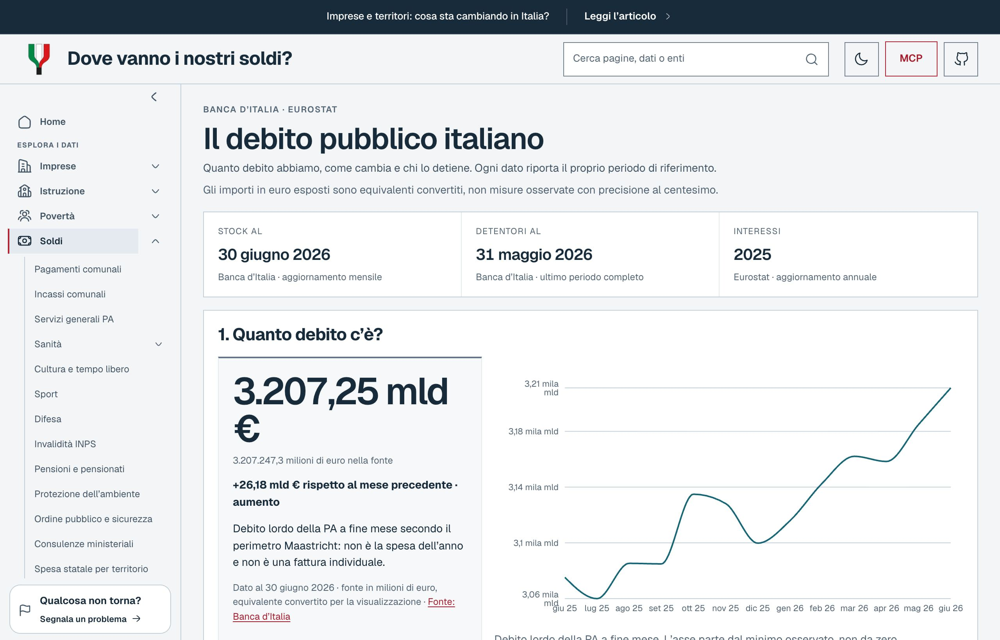 |

| Sanità | MCP |
| --- | --- |
| 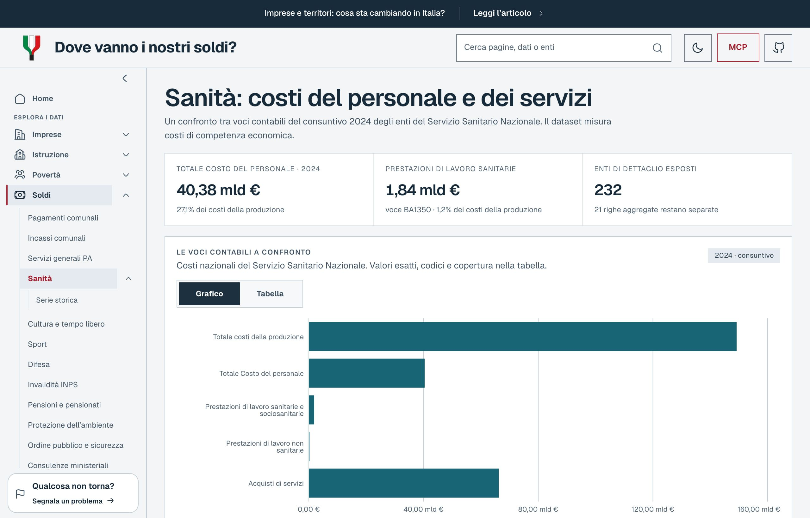 | 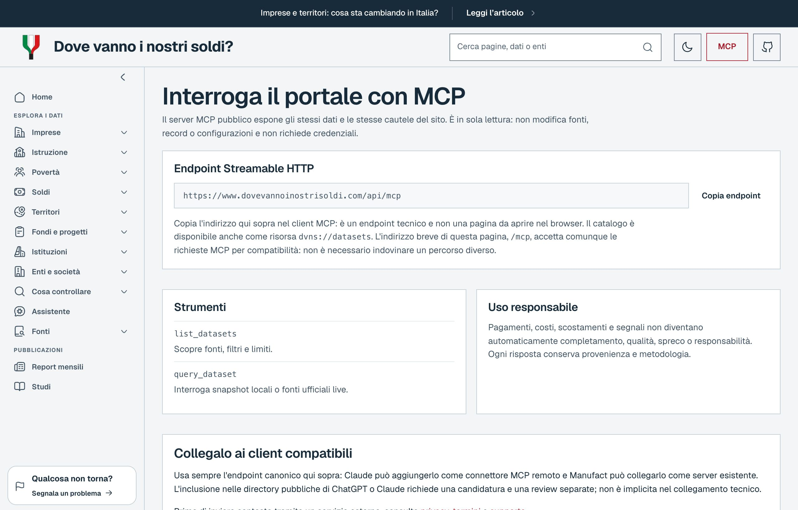 |

## Cosa trovi sul sito

| Sezione | In sintesi |
| --- | --- |
| [Home](https://www.dovevannoinostrisoldi.com/) | Pagamenti dei Comuni, mappa regionale, composizione della spesa |
| [Imprese](https://www.dovevannoinostrisoldi.com/imprese) | Imprese attive, addetti, localizzazioni e fatturato aggregato (ISTAT) |
| [Istruzione](https://www.dovevannoinostrisoldi.com/istruzione) | Studenti e percorsi della scuola secondaria di II grado per Regione (MIM) |
| [Soldi](https://www.dovevannoinostrisoldi.com/spese) | Uscite di cassa comunali (SIOPE), sanità, invalidità, pensioni, debito e bilancio |
| [Territori](https://www.dovevannoinostrisoldi.com/territori) | Confronti per Regione e Comune, profili OpenCivitas, CPT e IRPEF MEF |
| [Fondi e progetti](https://www.dovevannoinostrisoldi.com/coesione) | OpenCoesione e traccia PNRR asili (Italia Domani) |
| [Spese dello Stato](https://www.dovevannoinostrisoldi.com/stato) | Pagamenti per funzione e amministrazione (OpenBDAP/RGS) |
| [Debito pubblico](https://www.dovevannoinostrisoldi.com/debito) | Stock, detentori, scadenze e interessi (Banca d'Italia ed Eurostat) |
| [Legge di Bilancio](https://www.dovevannoinostrisoldi.com/spese/legge-di-bilancio) | Stanziamenti per missione e riallocazione ipotetica (OpenBDAP, competenza A1, non cassa) |
| [Istituzioni](https://www.dovevannoinostrisoldi.com/istituzioni) | Parlamento, Palazzo Chigi, pagella dei governi, ministeri e regioni |
| [Enti e società](https://www.dovevannoinostrisoldi.com/enti) | Indice PA, schede enti, partecipazioni MEF |
| [Cosa controllare](https://www.dovevannoinostrisoldi.com/controlli) | Segnali da fonti ufficiali, appalti, incarichi e catalogo dati |
| [Assistente](https://www.dovevannoinostrisoldi.com/assistente) | Domande testuali su snapshot verificati, senza modello generativo |
| [Fonti](https://www.dovevannoinostrisoldi.com/fonti) | Stato dei collegamenti, date di aggiornamento e calendario dei documenti programmatici |
| [MCP](https://www.dovevannoinostrisoldi.com/mcp) | Catalogo e istruzioni per collegare un client AI in sola lettura |
| [Dati](https://www.dovevannoinostrisoldi.com/dati) | Catalogo integrato interrogabile |

Pagine di dettaglio: [pensioni](https://www.dovevannoinostrisoldi.com/spese/pensioni), [sanità](https://www.dovevannoinostrisoldi.com/spese/sanita), [invalidità civile](https://www.dovevannoinostrisoldi.com/spese/invalidita), [pagella dei governi](https://www.dovevannoinostrisoldi.com/governi), [confronto Comuni](https://www.dovevannoinostrisoldi.com/territori/confronto), [partecipazioni](https://www.dovevannoinostrisoldi.com/partecipazioni).

## Come leggere il progetto

Non è un feed di accuse e non è un motore che inventa conclusioni. È uno strumento di lettura:

- separa pagamenti, stanziamenti, costi previsti e stock di debito;
- mostra quando una copertura è parziale;
- espone caveat e perimetro di ogni fonte;
- mantiene visibile il collegamento con l'origine ufficiale del dato.

## Regole in breve

- Nessun numero senza fonte e data.
- Nessun dato inventato o dimostrativo nelle pagine pubbliche.
- Pagamenti, costi previsti, debiti e ipotesi restano separati.
- Un segnale non è una colpa.
- I confronti usano solo misure compatibili.
- Se una fonte non risponde, il problema resta visibile.

Dettaglio: [docs/LEGAL_AND_ETHICS.md](docs/LEGAL_AND_ETHICS.md) e [docs/ARCHITECTURE.md](docs/ARCHITECTURE.md).

## Anno e limiti

Su Home, Soldi e Territori puoi scegliere `2024`, `2025` o `2026` (resta nell’URL, es. `/?anno=2025`).

Limiti importanti:

- ANAC CIG 2025: snapshot mensile verificato, non ricerca live per CIG o fornitore.
- PNRR: perimetro asili e prima infanzia; non include i pagamenti ReGiS né tutto il Piano.
- OpenCivitas 2022: Comuni a statuto ordinario (6.557 enti, 15 Regioni).
- Pagella dei governi: descrive il periodo osservato e il confronto con Francia, Germania e Spagna; non stima quanto sia attribuibile all’esecutivo.
- Assistente: intenti predefiniti, una domanda per volta; non risponde su un singolo Comune e non accetta richieste su frode o corruzione.
- Contabilità diverse non si sommano (SIOPE, IRPEF, CPT, costi previsti, debiti).

Registro integrato, copertura e caveat: [docs/INTEGRATED_SOURCE_LEDGER.md](docs/INTEGRATED_SOURCE_LEDGER.md).

## Per chi sviluppa

### Avvio locale

Node.js **22.19+**.

```bash
npm ci
npm run dev
```

Apri [http://localhost:3000](http://localhost:3000).

### MCP (assistenti AI)

Server [Model Context Protocol](https://modelcontextprotocol.io/) pubblico, sola lettura:

```text
https://www.dovevannoinostrisoldi.com/api/mcp
```

In locale: `http://localhost:3000/api/mcp`. Pagina catalogo: [/mcp](https://www.dovevannoinostrisoldi.com/mcp). Per evitare errori di configurazione, `POST /mcp` e `OPTIONS /mcp` sono alias compatibili dell'endpoint canonico; `GET /mcp` resta la pagina informativa.

Strumenti principali: `list_datasets`, `query_dataset`.

```json
{
  "mcpServers": {
    "dove-vanno-i-nostri-soldi": {
      "type": "http",
      "url": "https://www.dovevannoinostrisoldi.com/api/mcp"
    }
  }
}
```

Guida completa: [docs/MCP.md](docs/MCP.md). Distribuzione su client esterni: [docs/MCP_DISTRIBUTION.md](docs/MCP_DISTRIBUTION.md).

Il MCP pubblico di [Cruscotto Italia](https://cruscotto-italia.dati.gov.it/about.html#accesso-mcp) (AgID) è un servizio esterno complementare: DVNS non lo inoltra e non lo tratta come dato validato localmente.

### API HTTP

Esempi:

```text
GET /api/spese/comuni
GET /api/territori/irpef?anno=2024&livello=regione
GET /api/controlli
GET /api/dati/consulenze-legali?q=2024&limit=20
```

Elenco e contratti: documentazione in `docs/` e catalogo su [/mcp](https://www.dovevannoinostrisoldi.com/mcp).

### Controlli prima di una modifica

```bash
npm run lint
npm test
npm run typecheck
npm run design:check
npm run build
npm run test:browser:e2e
npm run test:lighthouse
```

Gli ultimi due richiedono il build di produzione su `http://127.0.0.1:3000`. Dettagli in [CONTRIBUTING.md](CONTRIBUTING.md).

### Screenshot del README

```bash
DVNS_BASE_URL=https://www.dovevannoinostrisoldi.com npm run readme:screenshots
```

Le catture finiscono in `docs/readme/`. In locale si può puntare a un `next start` sulla stessa porta usata per i test.

### Aggiornamento dati

Gli script in `scripts/etl/` scaricano le fonti ufficiali e producono gli snapshot usati dal sito. Esempio:

```bash
python3 scripts/etl/siope_municipal_snapshot.py --year 2025 \
  --output src/data/generated/siope-municipal-2025.json
python3 scripts/etl/opencoesione_snapshot.py --check
python3 scripts/etl/public_debt_snapshot.py --check
```

La route `/debito`, `GET /api/debito` e il dataset MCP `debito_pubblico_italiano`
usano lo stesso snapshot verificato di Banca d'Italia ed Eurostat. Il refresh
live è atomico; la CI delle pull request usa esclusivamente fixture offline.

Politica di freschezza: [docs/FRESHNESS_AND_REFRESH.md](docs/FRESHNESS_AND_REFRESH.md).

### Struttura del repository

```text
src/app/            pagine e API
src/components/     interfaccia
src/lib/            lettura e collegamento dati
src/lib/mcp/        catalogo MCP
src/data/generated/ snapshot verificati
scripts/etl/        aggiornamento fonti
tests/              controlli automatici
docs/               metodo, architettura, note legali
```

## Contribuire

Segnalazioni utili: fonti mancanti, correzioni alle spiegazioni, qualità dei dati, accessibilità. Dal sito puoi usare il pulsante «Segnala un problema», presente in ogni pagina: crea una issue pubblica già strutturata ([docs/SEGNALAZIONI.md](docs/SEGNALAZIONI.md)).

Se vuoi contribuire anche senza scrivere codice, sono utili:

- segnalazioni di fonti ufficiali mancanti;
- controlli sui testi e sulla chiarezza delle spiegazioni;
- verifiche su date, perimetri e limiti esposti nelle pagine;
- feedback su accessibilità e leggibilità.

Prima di una PR leggi [CONTRIBUTING.md](CONTRIBUTING.md).

Ruoli dei maintainer e regole di decisione: [GOVERNANCE.md](GOVERNANCE.md).

Per una vulnerabilità non ancora corretta non aprire una issue: usa il [canale privato](SECURITY.md).

Per una nuova fonte, in issue indica: ente, URL ufficiale, licenza, formato, frequenza, identificativi (IPA, CF, CIG, CUP) e cosa il dato **non** misura.

Richieste della community: [docs/COMMUNITY_FEEDBACK.md](docs/COMMUNITY_FEEDBACK.md).
Coda di sviluppo con priorità e issue: [docs/ROADMAP.md](docs/ROADMAP.md).

## Fondatori

- [@fragiannicola](https://x.com/fragiannicola)
- [@dom_gag_96](https://x.com/dom_gag_96)

## Contributors

<!-- Grazie a tutti i contributori del progetto! -->

<a href="https://github.com/metaforismo"></a>
<a href="https://github.com/dg996"></a>
<a href="https://github.com/sephmartin"></a>
<a href="https://github.com/lucaosti"></a>
<a href="https://github.com/rinocitarella"></a>
<a href="https://github.com/Elgabor"></a>
<a href="https://github.com/marianimatteo-lexroom"></a>
<a href="https://github.com/nellicus"></a>
<a href="https://github.com/Zer0codestuff"></a>
<a href="https://github.com/calca"></a>
<a href="https://github.com/saliougaye"></a>
<a href="https://github.com/VoxamVox"></a>
<a href="https://github.com/danielemeanti23"></a>
<a href="https://github.com/not-knope"></a>
<a href="https://github.com/superpios"></a>

## Licenza

Il codice è sotto [GNU Affero GPL v3](LICENSE).

Puoi usare, studiare e migliorare il progetto rispettando l’AGPL (incluso, quando richiesto, il codice sorgente corrispondente). Per un prodotto o servizio proprietario da vendere senza obblighi AGPL serve una [licenza commerciale](COMMERCIAL.md).

I dati di terzi restano sotto le loro licenze: [THIRD_PARTY_NOTICES.md](THIRD_PARTY_NOTICES.md).
