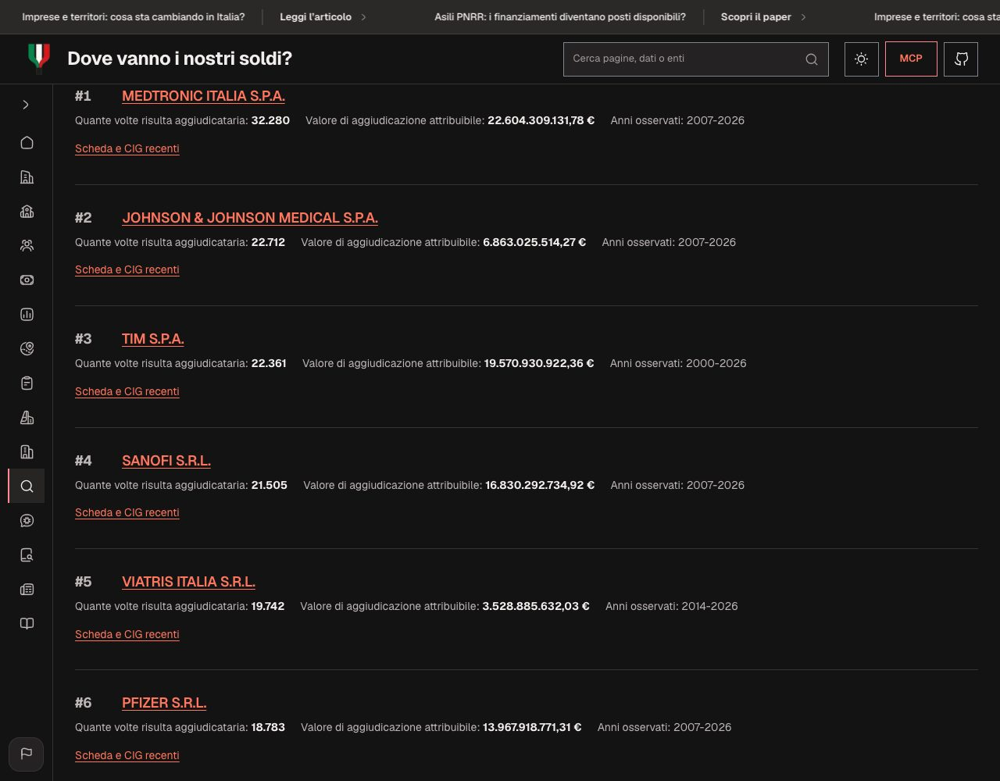
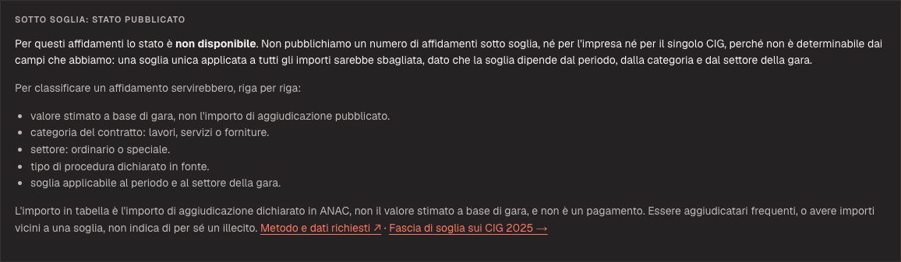
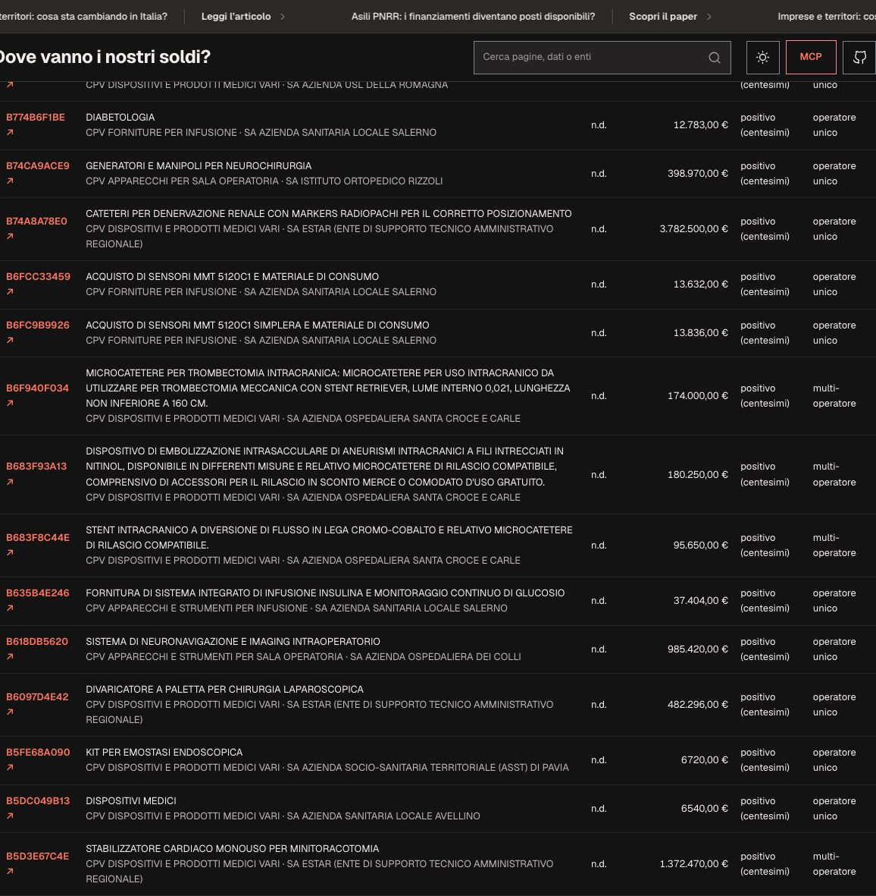
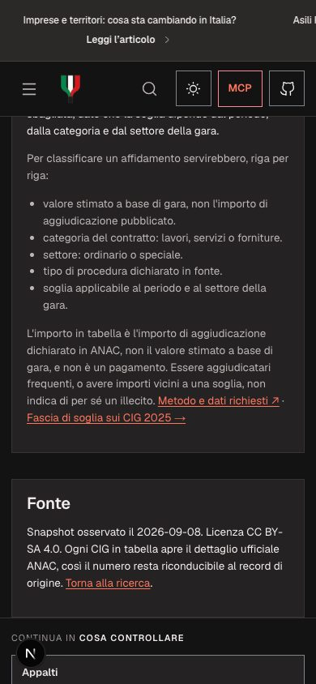

# Sotto soglia nell'indice operatori ANAC

Questa nota documenta perché l'indice nazionale degli operatori pubblicato in
`/appalti/operatori` **non** espone un conteggio di affidamenti «sotto soglia» e
cosa servirebbe per farlo senza inventare il dato.

## Cosa contiene l'indice

`src/data/generated/anac-operator-awards-index/` deriva dai full snapshot
ufficiali ANAC `aggiudicatari` e `aggiudicazioni`, arricchiti con i campi di
procedura dei CIG annuali 2007-2025
(`oggetto_lotto|oggetto_gara`, `cod_cpv`, `descrizione_cpv`,
`denominazione_amministrazione_appaltante`, `anno_pubblicazione`).

Per ogni operatore pubblica:

- chiave stabile: il codice fiscale italiano valido usato solo internamente; in
  pubblico resta il riferimento opaco `op-########`;
- numero di relazioni di aggiudicazione e valore attribuibile (importo di
  aggiudicazione dichiarato, solo con un unico operatore);
- anni minimo e massimo osservati;
- fino a 15 aggiudicazioni recenti con CIG, data, importo, stato dell'importo e
  attributo, più i campi di procedura abbinati per CIG;
- le prime 5 categorie CPV e le prime 5 stazioni appaltanti fra le
  aggiudicazioni pubblicate e abbinate.

## Perché non pubblichiamo «sotto soglia»

«Sotto soglia» non è una proprietà dell'importo: dipende dalla **soglia
applicabile alla specifica gara**. Per classificare correttamente un affidamento
servono, riga per riga:

1. il **valore stimato a base di gara** (non l'importo di aggiudicazione
   pubblicato, che è successivo, al netto del ribasso e riferito all'esito);
2. la **categoria del contratto**: lavori, servizi o forniture;
3. il **settore**: ordinario o speciale;
4. il **tipo di procedura dichiarato in fonte**;
5. la **soglia applicabile al periodo e al settore** della gara, che cambia nel
   tempo e con la normativa.

L'indice pubblica solo una parte di questi campi: non pubblica il valore a base
di gara, non pubblica la categoria né il settore, e i CIG annuali importati non
includono per ogni riga il tipo di procedura. Di conseguenza:

- nessun conteggio «sotto soglia» è pubblicato, né per l'impresa né per il
  singolo CIG;
- nessuna soglia unica viene applicata agli importi: sarebbe un numero falso per
  la maggior parte delle righe;
- lo stato pubblicato è la costante `BELOW_THRESHOLD_STATUS = "non disponibile"`
  in `src/lib/anac-operator-award-insights.ts`, con l'elenco esatto degli input
  mancanti.

Lo stesso divieto vale per l'equivalenza «affidamento diretto = sotto soglia»:
le due cose non coincidono e l'indice non contiene comunque l'etichetta di
procedura per ogni riga.

## Cosa è pubblicato al posto del conteggio



- conteggi e importi dichiarati in fonte, con stato dell'importo esplicito
  (`positivo`, `zero`, `mancante`, `non valido`, `conflittuale`);
- numero di **stazioni appaltanti distinte** fra le aggiudicazioni pubblicate e
  abbinate: è esatto finché l'elenco resta sotto il tetto di 5 voci, oltre il
  quale diventa un minimo dichiarato («5 o più»);
- **link ufficiale al dettaglio CIG ANAC** per ogni CIG, così il numero resta
  riconducibile al record di origine;
- la fascia di importo dichiarata da ANAC per i CIG 2025 resta sulla pagina
  `/appalti`, con il suo denominatore e i suoi limiti. Quella fascia è una
  lettura di screening aggregata, non una classificazione per operatore.

## Cosa servirebbe per implementarlo

1. estrarre dai CIG annuali, per ogni CIG, i campi `tipo_scelta_contraente`,
   `importo_lotto`, `settore` e `oggetto_principale_contratto`;
2. collegare a ogni riga la soglia applicabile al periodo della gara, con una
   fonte normativa versionata (tabelle di soglia per periodo, categoria e
   settore) e la sua data di validità;
3. dichiarare il denominatore usato (per esempio i soli CIG di un anno) e
   mantenere distinti valore stimato, importo di aggiudicazione e pagamento;
4. pubblicare lo stato per riga (`classificabile`, `non classificabile`) senza
   trasformare un'assenza in zero.

Finché questi input non sono disponibili, un numero sotto soglia nella scheda
operatore sarebbe una stima presentata come dato: la scelta del progetto è
lasciarlo fuori e dichiararlo.

## Come appare

La scheda dichiara lo stato e gli input mancanti senza mostrare alcun numero al
posto del dato:



Ogni CIG pubblicato apre il dettaglio ufficiale ANAC, così il conteggio resta
riconducibile al record di origine:



Lo stesso contenuto e la stessa gerarchia restano leggibili a 390 px:



L'hub riporta la stessa dichiarazione nel glossario, prima delle tabelle, così
la limitazione è visibile anche a chi non apre una scheda:


## Verifica

I vincoli di questa pagina sono coperti da test:

```sh
node --experimental-strip-types --test tests/anac-operator-award-insights.test.mjs tests/appalti-operatori-page.test.mjs
```

I test verificano la forma del link CIG, il conteggio delle stazioni distinte
(esatto e con tetto), la presenza dell'elenco di input richiesti e il fatto che
le pagine dichiarino lo stato «non disponibile».
