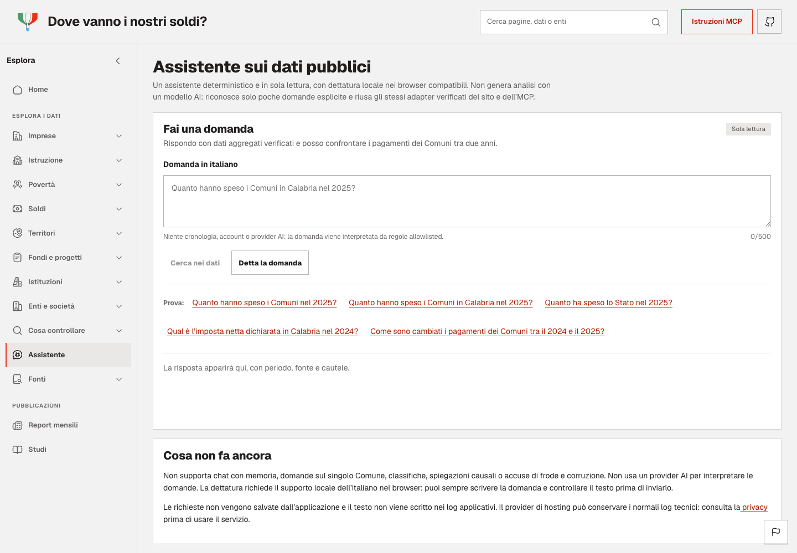
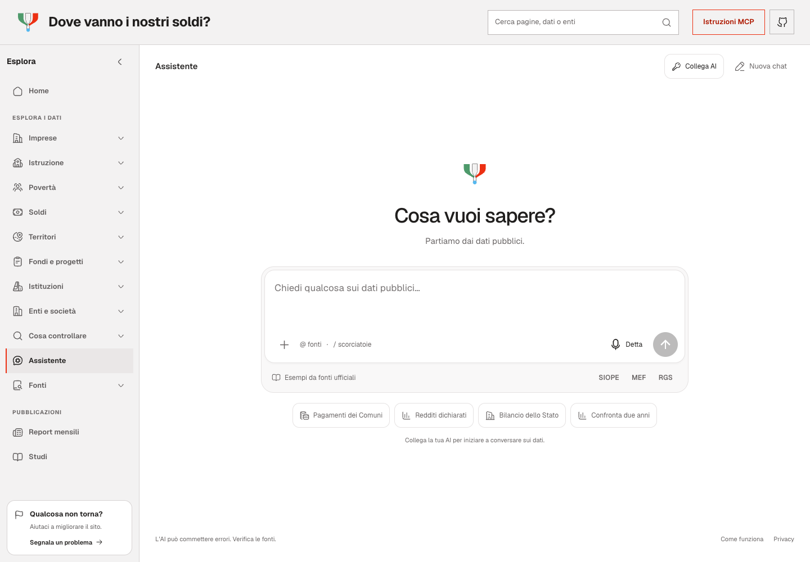

# Assistente: compositore e AI personale

La pagina pubblica `/assistente` usa il compositore chiaro approvato. La precedente
`/assistente/anteprima` reindirizza permanentemente alla pagina pubblica.

Il controllo browser ripetibile è `npm run test:browser:assistant`: screenshot iniziale,
conversazione e impostazioni a 320, 390, 768 e 1280 px in `artifacts/browser/`.
La dettatura inline mantiene il motore locale: `npm run test:browser:voice`.
Architettura, trattamento delle chiavi e limiti sono descritti in `docs/ASSISTENTE.md`.

## Prova reale nel browser

Il 7 settembre 2026 il browser integrato ha usato OpenRouter con
`openai/gpt-5.6-luna` e una chiave personale fornita per questa verifica.
Sono state verificate una domanda nazionale SIOPE 2025, una domanda successiva
sulla Calabria, la modifica in Lombardia, la rigenerazione e il confronto
Calabria 2024–2025. La risposta nazionale riportava 114.197.852.372,52 euro;
il confronto regionale riportava 4.257.404.807,12 e 4.651.243.753,62 euro,
con periodo e limiti espliciti.

Il browser ha ricevuto `text/event-stream` con più blocchi di risposta.
Copia, annullamento della modifica, interruzione, nuova chat, suggerimenti e
apertura delle impostazioni senza chiave sono stati provati nell'interfaccia.
Al termine la chiave è stata scollegata e il campo password verificato vuoto.
Nessuna chiave è inclusa in questo documento o nei test.

Le chiamate reali a OpenAI e Anthropic non sono state eseguite: i loro
protocolli, strumenti e stream sono coperti da risposte simulate nei test.
I test browser automatici usano una chiave fittizia e risposte simulate;
non rappresentano ulteriori chiamate pagate. Il costo effettivamente addebitato
al conto OpenRouter non è stato misurato.

## Allegati: prove reali e responsive

Il 7 settembre 2026 sono stati generati PDF, DOCX, XLSX, TXT e PNG sintetici
(Comune di Esempio, nessun dato personale) e caricati nel browser con il selettore file.
Dopo un errore di autenticazione con una prima chiave, una seconda chiave autorizzata
ha completato due domande reali a Luna:

- PDF + Word + Excel: biblioteca 120.000/90.000 euro, parco 80.000/40.000;
  residui 30.000 e 40.000; pagamenti 75%, 50% e 65% complessivo ponderato.
  La risposta ha rilevato che il Word contiene solo la biblioteca e ha citato i file.
- PNG + TXT: lettura nell’immagine dei 90.000 euro pagati e dello stanziamento
  di 120.000 euro presente anche nella nota. Provenienza sintetica dichiarata.

Sono prove locali con un provider reale, non prove del deployment. Non è stato
misurato il costo esatto né registrata la telemetria dei token di ragionamento.
La chiave è stata scollegata al termine. I test automatici successivi non la usano.

`npm run test:browser:attachments` verifica estrazione effettiva dei sei formati
PDF/DOCX/XLSX/PNG/TXT/MD, anteprima, conservazione nei messaggi, modifica e
rigenerazione, limiti ed errori a 320, 390, 743, 768, 983 e 1280 px. Le risposte AI di questa
suite sono simulate. Le finestre intermedie alte 695 px coprono anche il difetto del footer che si
sovrapponeva ai suggerimenti quando crescevano prompt e allegati.
Screenshot: `artifacts/browser/assistant-attachments-<larghezza>-*.png`.

## Ulteriori prove reali e correzioni

Il 7 settembre sono state completate nel browser integrato anche queste prove:

- SIOPE 2024, modalità automatica/rapida: 109.473.053.743,63 euro e conteggi di copertura
  confrontati con l’output effettivo dell’adapter.
- Sei allegati insieme (PDF, DOCX, XLSX, PNG, TXT, Markdown): cifre coerenti,
  omissioni del Word riconosciute, percentuali 75% e 50%, totale ponderato 65%.
- IRPEF Lombardia, modalità approfondita e rapida: entrambe riportano 7.607.245
  contribuenti e 223.808.958.620 euro, anno d’imposta 2024 e dichiarazione 2025.
  I due valori sono stati confrontati con `queryPublicDataset`, senza chiamate AI.

Le prime due prove IRPEF hanno rilevato problemi: scelta di una tabella di dettaglio
senza filtro regionale, poi lettura dei centesimi come euro. Sono stati corretti
il contesto del pianificatore e la proiezione monetaria dedicata alla chat. Le due
risposte finali sopra sono successive alle correzioni. Gli snapshot pubblici e il
contratto MCP restano invariati.

Le modalità sono parametri richiesti a OpenRouter (`none` e `medium`), verificati
anche nei test del protocollo; non è stata misurata la quantità effettiva di token
di ragionamento. Le chiavi sono state rimosse dalle schede dopo le prove.

La suite allegati verifica otto file, rifiuto del nono, anteprime, riduzione del
contesto, incolla oltre 8.000 caratteri trasformato in TXT e campo a scorrimento
interno oltre il limite. La dettatura conserva il testo riconosciuto senza
troncamento silenzioso. Il modulo di segnalazione viene verificato nella sidebar,
in modalità compatta, nel menu mobile e durante un cambio di viewport.

## Confronto desktop per la PR

Entrambe le immagini sono catture del browser a 1440 × 1000, scala 1.
Il Prima è la pagina pubblica acquisita il 7 settembre prima del merge; il Dopo
è la pagina iniziale del nuovo assistente nella build di produzione locale.

### Prima

### Dopo

