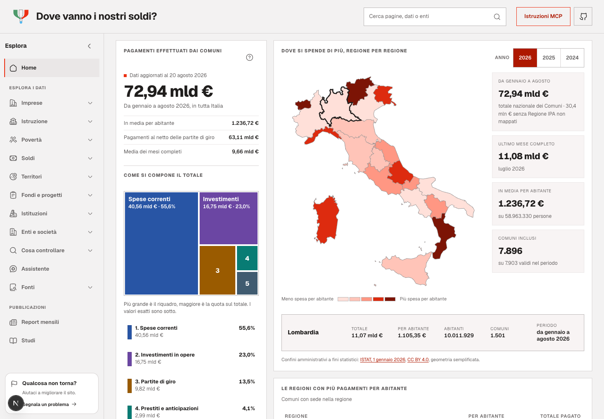
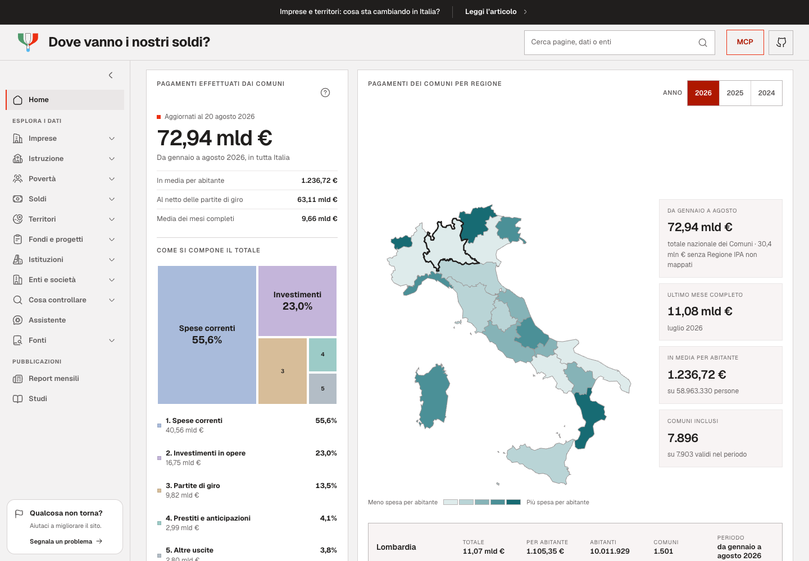
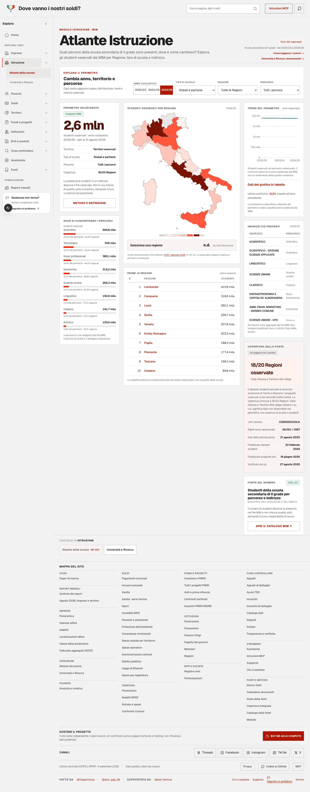
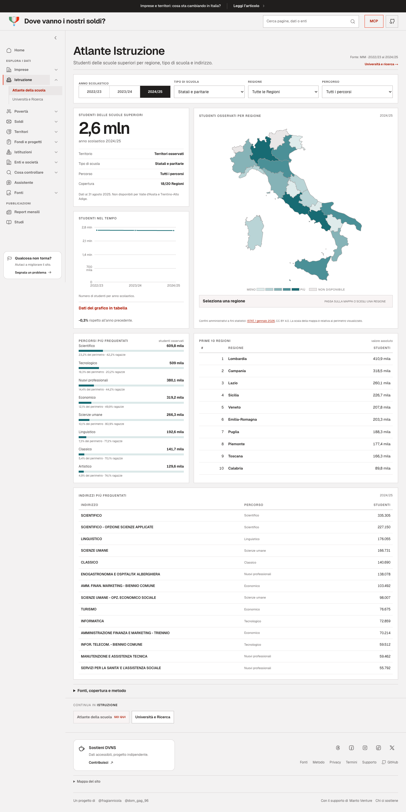
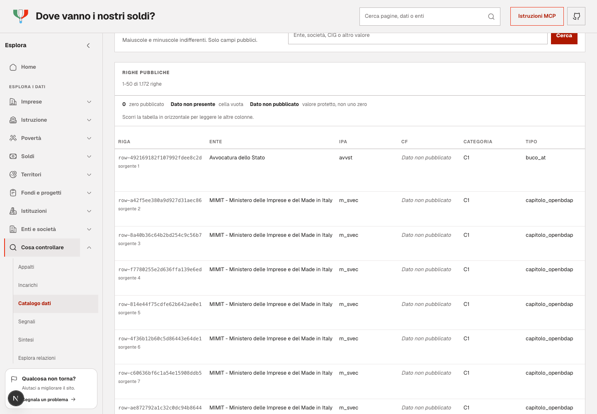
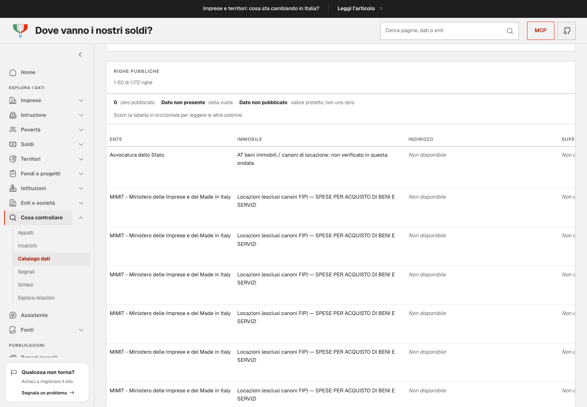

# Confronto visivo — issue #331

La versione prima è `main` al commit `9a616572997f8cfa1794a883153cfa3dbbe30939`, avviata in un checkout isolato. La versione dopo è la build locale `Mrpv9mWTtBL7jfQENfiew` della revisione descritta nel [resoconto](../2026-09-07-main-ui-polish.md).

Chromium, 1440 × 1000, scala 1. Istruzione è acquisita a pagina intera; Affitti è posizionata all'inizio della tabella. Gli screenshot documentano il layout e non sostituiscono la verifica delle fonti. Gli snapshot delle due versioni sono invariati.

| Pagina | Prima | Dopo |
| --- | --- | --- |
| Home |  |  |
| Istruzione |  |  |
| Affitti e immobili |  |  |
